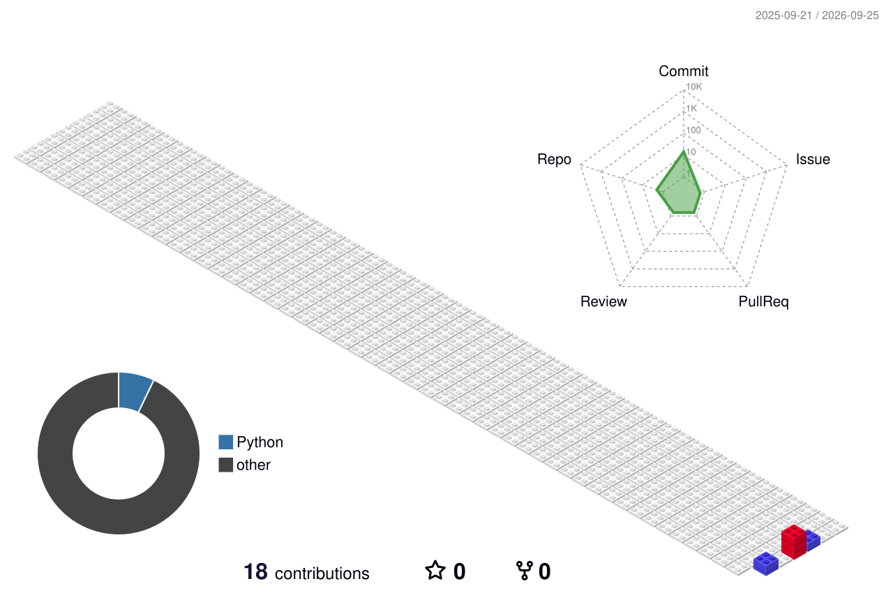

## Hi there :sunglasses:

<!--
**elpapadlospollitos/elpapadlospollitos** is a ✨ _special_ ✨ repository because its `README.md` (this file) appears on your GitHub profile.

Here are some ideas to get you started:

- 🔭 I’m currently working on ...
- 🌱 I’m currently learning ...
- 👯 I’m looking to collaborate on ...
- 🤔 I’m looking for help with ...
- 💬 Ask me about ...
- 📫 How to reach me: ...
- 😄 Pronouns: ...
- ⚡ Fun fact: ...
-->

https://readme-typing-svg.demolab.com/demo/?font=Permanent+Marker&weight=300&color=F7B433&center=true&lines=Software+-+Firmware+-+Hardware;Embedded+Systems+Design;Developing+from+Silicon+to+Cloud;Focusing+on+Clean+Architecture

💻 Firmware Developer | IoT | Embedded Systems

🔧 APIs • Firmware • Data Integration

🚀 Building, learning & experimenting with technology

## Contacto

## Tecnologías más usadas

### :book: Lenguajes

### :hammer_and_wrench: Librerias y Frameworks 

### :thinking: Otras...

## :seedling: Trabajando...

